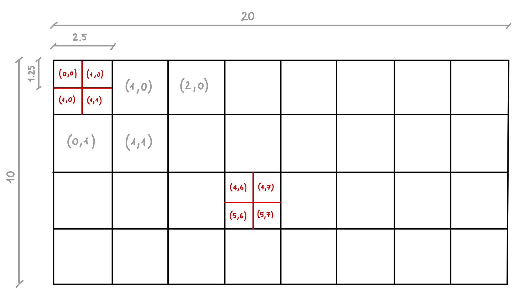
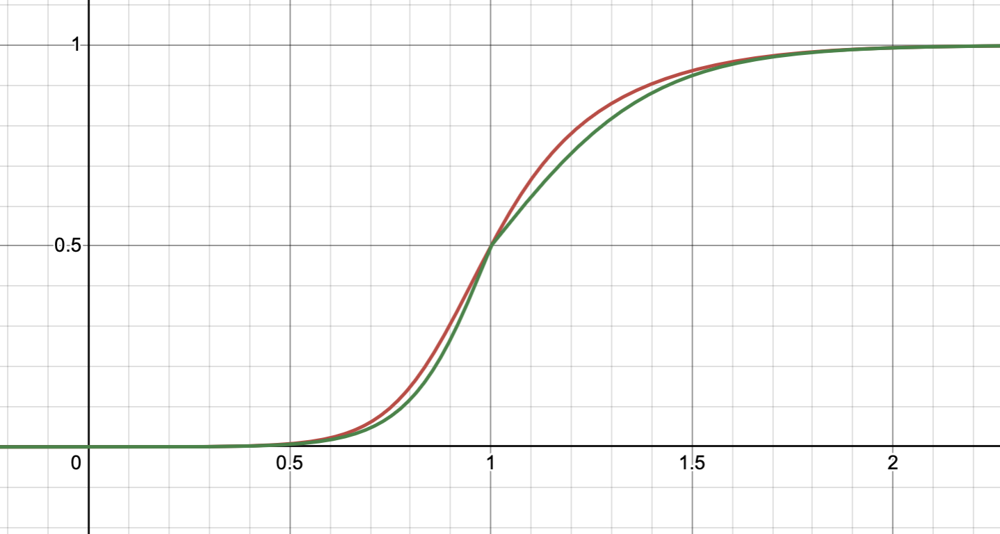

## Schedule

- [x]  State
- [x]  Actions
- [x]  State prediction from action
- [x]  Search Strategy
- [x]  Success probability function
- [x]  Map exploration algorithm
- [x]  Expected reward algorithm
- [x]  ~~Heuristic~~
- [ ]  Simulation


# Project Overview

The EIS (Exploration and Information System) Project is focused on developing an autonomous decision-making system for coordinated UAV-UGV operations. The system manages state tracking, action planning, and strategic exploration in complex environments.

The core components include:

- A comprehensive state management system tracking vehicle positions, tasks, discoveries, and resources
- A flexible action framework supporting various mission-critical operations for both aerial and ground vehicles
- Advanced search strategies utilizing random forests and heuristic-based exploration algorithms
- Predictive state modeling for optimal decision-making

The project aims to maximize mission effectiveness while handling critical constraints such as battery life, task deadlines, and vehicle-specific capabilities.

---

## Notes

- The score is weighted on the probability of success
    - Each task should have a success probability

## Structures

### State

```json
{
	"score": {
		"type": "double"
	},
	"timestamp": {
		"type": "int"
	}
	// UAV
	"uav": {
		"subzone":{
			"type": "int"
		},
		"current_task": { // could be None (for the prediction)
			"type": {
				"type": "string",
				"enum": ["find_object", "find_target", "emergency_landing", "none", "follow_sequence", "highest_spot_landing", "return_to_base"],
			},
			"success_probability": {
				"type": "double"
			},
			"start_time": {
				"type": "int"
			},
			"deadline": {
				"type": "int"
			},
			"max_value": {
				"type": "int"
			},
			"preemptive": {
				"type": "bool" // bool value 
			}
		},
		"battery": {
			"type": "double"
		},
		"explored_subzones": {
			"type": "array",
			"items": {
				"x": {
					"type": "int"
				},
				"y": {
					"type": "int"
				}
			}
		}
	},
	"ugv": {
		"subzone":{
			"type": "int"
		},
		"current_task": { // could be None (for the prediction)
			"type": {
				"type": "string",
				"enum": ["find_object", "find_target", "emergency_landing", "none", "follow_sequence", "highest_spot_landing", "return_to_base"],
			},
			"success_probability": {
				"type": "double"
			},
			"start_time": {
				"type": "int"
			},
			"deadline": {
				"type": "int"
			},
			"max_value": {
				"type": "int"
			},
			"preemptive": {
				"type": "bool" // bool value 
			}
		},
		"battery" : {
			"type": "int",
		}
		"explored_subzones": {
			"type": "array",
			"items": {
				"x": {
					"type": "int"
				},
				"y": {
					"type": "int"
				}
			}
		}
	}
}
```

### Context

```json
{
	"state", // reference to the previous one
	"task_list": {
		"type": "array",
		// Leonardo task definition
	},
	"target_list": {
		"type": "array",
		"items": {
			"id": {
				"type": "int"
			}, 
			"zone": {
			},
		"agents": [] // UAV, UGV, PTZ
		"pose", // more useful for the Leonardo project
		}
	},
	"object_list": {
		"type": "array", 
		"zone",
		"agents": [] // UAV, UGV, PTZ
		"pose" // more useful for the Leonardo project
	},
}
```

### Leonardo task definition

```json
{
    "type": "object",
    "properties": {
        "task_id": {
            "type": "int"
        },
        "task_type": {
            "type": "string",
            "enum": ["find_target", "find_object", "follow_sequence", "land_highest_spot", "emergency_landing", "return_to_base"]
        },
        "agent": {
            "type": "string",
            "enum": ["uav", "ugv", "ptz"]
        },
        "target_type": {
            "type": "string",
            "enum": ["aruco", "object"]
        },
        "target_id": {
            "type": "int"
        },
        "request_time": {
            "type": "string",
            "format": "date-time"
        },
        "deadline": {
            "type": "string",
            "format": "date-time"
        },
        "zones":{
		"type": "array",
			"x": {
				"type": "int"
			},
			"y": {
				"type": "int"
			}
		},
        "max_value": {
            "type": "int"
        }
    },
    "required": [
        "task_id",
        "task_type",
        "agent",
        "request_time",
        "deadline",
        "max_value"
    ],    
}
```

### Task response message (REVIEW THIS)

```json
{
 "task_id",
 "target_type",
 "request_time",
 "completion_time",
 "result"
}
```

## Tasks

When the task is `None`, the action `continue` doesn’t exists.

Each task is defined by:

- the `complexity` coefficient
- the `nominal_duration` coefficient

The `success_probability` is computed on the base of deadline, complexity and the distance from the target/object/zone (current subzone wrt target subzone).

### Constraints

The target is considered completed when it is observed for 2 seconds at least and if it is correctly associated with the zone where it is placed.

### Sources

- Mission manager
- PTZ
- Found target/object

### Notes

- Find object task: the reward is obtained only if the UAV orbits around the object, else reward is 0 (**REVIEW THIS**)
- Highest spot landing: completed when lands on the highest spot, turn the engine off and send the picture to the GCS
- Emergency landing and return to base should be executed immediately only if the expected reward is the best one wrt other tasks

## Actions

| Tasks | UAV  | UGV |
| --- | --- | --- |
| **Exploration** | ✅ | ✅ |
| **Orbit around object** | ✅ |  |
| **Stop to look at target/object** | ✅ | ✅ |
| **Follow sequence (target)** | ✅ | ✅ |
| **Highest spot landing** | ✅ |  |
| **Emergency landing (UAV)** | ✅ |  |
| **Return to base (UGV)** |  | ✅ |
| **Continue** | ✅ | ✅ |
- Exploration (go to a specific sub-zone) → provided by the exploration algorithm
    - Some probability to find target/object (define how)
- Orbit around object → when object is found by UGV (non-preemptive)
- Stop to look at target/object
- Follow sequence (target)
- Highest spot landing
- Emergency landing (UAV) [Critical → Deadline = 0] **JUST ONE TRY**
- Return to base (UGV) [Critical → Deadline = 0] **JUST ONE TRY**
- Continue → Do nothing and just continue with the current action

## Search strategy

### Notes

Random forest by building more trees using a stochastic approach and then using the highest value solution.

## State prediction

Deterministic.
Each action has its own function to predict the next state from the current one, and takes a certain amount of time.
For each action varies both battery and timestamp.

### Exploration (or go to a sub-zone)

The score is not strictly equivalent to the one of the competition.
The less you know the more the exploration gives a better score.

**Status updates**

- `timestamp`: depends on the travel speed and distance with some standard deviation (gaussian)
- `battery`: depends on the travel speed integrated over time with some standard deviation (gaussian)
- `explored_subzones`: depends on the exploration strategy
- `subzone`

The target exploration gives an higher scores.

**Targeted exploration strategy** 

For each object and target, takes the possible zone and accumulates them into an heatmap and takes the hottest zone.
If the heap is the same, it returns all of them.

**Exploration for coverage**

**To be defined** in order to maximize the coverage of unvisited zones following an heuristic.

### **Orbit around object**

- **State updates**
    - `timestamp`
    - `battery`
    - `subzone`
    - `success_probability`
    - `score`: stochastic
    - `explored_subzones`

### **Stop to look at target/object**

- **State updates**
    - `timestamp`
    - `battery`
    - `success_probability`
    - `score`: stochastic
    - `aruco` or `object`

### **Follow sequence (target)**

- **State updates**
    - `timestamp`
    - `battery`
    - `success_probability`
    - `subzone`
    - `score`: stochastic
    - `explored_subzones`

### **Highest spot landing**

- **State updates**
    - `timestamp`
    - `battery`
    - `success_probability`
    - `subzone`
    - `score`: stochastic
    - `explored_subzones`

### **Emergency landing (UAV)**

- **State updates**
    - `timestamp`
    - `battery`
    - `success_probability`
    - `subzone`
    - `score`

### **Return to base (UGV)**

- **State updates**
    - `timestamp`
    - `battery`
    - `success_probability`
    - `subzone`
    - `score`: stochastic
    - `explored_subzones`

### **Continue**

- **State updates**
    - `timestamp`
    - `battery`
    - `success_probability`
    - `subzone`
    - `score`: stochastic
    - `explored_subzones`

| **Action** | **Status Updates** | **Notes** |
| --- | --- | --- |
| **Exploration** | `timestamp`, `battery`, `explored_subzones`, `subzone` |  |
| **Orbit around object** | `timestamp`, `battery`, `subzone`, `success_probability`, `score`, `explored_subzones` |  |
| **Stop to look at target/object** | `timestamp`, `battery`, `success_probability`, `score`, `aruco`/`object` |  |
| **Follow sequence** | `timestamp`, `battery`, `success_probability`, `subzone`, `score`, `explored_subzones` |  |
| **Highest spot landing** | `timestamp`, `battery`, `success_probability`, `subzone`, `score`, `explored_subzones` |  |
| **Emergency landing** | `timestamp`, `battery`, `success_probability`, `subzone`, `score` |  |
| **Return to base** | `timestamp`, `battery`, `success_probability`, `subzone`, `score`, `explored_subzones` |  |
| **Continue** | `timestamp`, `battery`, `success_probability`, `subzone`, `score`, `explored_subzones` |  |

## Search Strategy

The objective is to maximize the reward.
The stop condition (on the depth) for the expansion is a limit for the `timestamp`.
The search strategy is `best_first` using random noise (stochastic) $ε_{\text{greedy}}$.

The overall stop condition is:

- end of the execution time
- each leaf node has exceeded the `timestamp`
- it has reached the max depth

### Graph search triggers

- Fixed time interval
- State changes wrt actual state of `aruco`, `objects`, `current_task`, `subzone`.

## Map



### Definition

- **Dimensions**
- **Zone dimensions**
- **Subzones:**
    
    The $z$ component is fixed for each subzone.
    Each subzone must be a square.
    It is possible to define width ($`x`$) and length ($`y`$) of the subzone.
    
    - **Obstacles**
        
        A subzone can be labeled as an obstacle zone → must be avoided.
        It is a list of subzones where they are placed.
        
    
    If a subzone is partially occupied from an obstacle, it will be considered as occupied.

## Exploration algorithm

### **Strategy generator**

Returns two target points:

1. One that optimizes the **hotness**
2. One that optimizes the **coverage**

When an object/target has been found, it will be removed from the heatmap.

### **Path planner**

Returns two path.
It is an $`A^\star`$ computed on the occupancy grid with distances weighted on:

- **heatmap**
- **coverage map**

For each path it returns:

- **Manhattan Distance [$`d_m`$](https://www.notion.so/EIS-Project-1b5ec7177fc9806a98f9c9dc60c59566?pvs=21)**
- `explored_subzones`
- `subzone`

### Distance calculation

$$
\begin{aligned}
&\text{Heatmap} \\
& \begin{cases}\text{H}_m \ \in [0, 1] \\
d_H=(1-\text{H}_m)+\omega_d
\end{cases}\end{aligned}
$$

$$
\begin{aligned}
& \text{Coverage map} \\
& \begin{cases}\text{C}_m \ \in [0, 1] \\
d_c=(1-\text{C}_m)+\omega_d
\end{cases}\end{aligned}
$$

Where $`\omega_d`$ is the weight of the distance over the secondary objective and it is defined as follow:

- $`\omega_d=1`$ means that it weights more half the distance and alf the secondary objective
- $`\omega_d=0`$ means that it weights just the object
- $`\omega_d>>1`$ means that it weights only to optimize the distance

## Reward

One of the rewards’ element is weighted on the explored area for the given action.
The explored areas are compared with the object/target’s heatmap in order to compute the action that covers the hottest zones.
⇒ This is handled by the planner

$$
R = p_s\cdot s_e\cdot\left(1-\Delta b\right)^{\frac1{\omega_b}}\cdot\left(1-r_{t}\right)^{\frac1{\omega_r}}\cdot\omega_s
$$

### Success probability function $`p_s`$

**Task parameters $`T`$**

- **Complexity coefficient $`C \ [\text{\%}]`$**
    - `complexity`
        - **JSON** → Values in $`\left[0, 100\right]`$
        - **Engine** → Values in $`\left[0, 1\right]`$
- **Duration coefficients $`t_n \ [\text{s}]`$**
    - `nominal_duration`

**Runtime parameters $`R`$**

- **Distance $`d_m \ [\text{m}]`$**
Distance between the current subzone and the target one.
    - Manhattan Distance
- **Remaining time $`t_d \ [\text{s}]`$**
    - Deadline for the task

**Agent parameters $`A`$**

- **Average speed $`v_a\ [\text{ms}^{-1}]`$**

$$
\begin{aligned}
& t_{\text{tot}} = \frac{d_m}{v_a} + t_n \\
& K(x) = \begin{cases}
 \frac{1}{1+e^{10(1-x)}} & \text{if } x<1 \\
 \frac{1}{1+e^{5(1-x)}} &\text{if } x≥1 \end{cases}
 \\
& p_s=p(s|A,R,T)=(1-C) \cdot K\left(\frac{t_d}{t_{\text{tot}}}\right)
\end{aligned}
$$


*$`K(x)`$ function*

The last equation highlights the principle that the probability is the highest one when the complexity $`C`$ is low, i.e. the probability is $`1`$ when the complexity is $`0`$ and the remaining time is twice the total time.

It also updates the `timestamp` for the next state using $`t_{\text{tot}}`$.

### Expected score $`s_e`$

Depends on the `max_value`, `deadline`, $`t_{\text{tot}}`$.

**Continue action will use a coherence coefficient.** 

### Battery $`\Delta b`$

Battery consumption (consumption model needs to be defined) for completing the task.

### Total time ratio $`t_{f}`$

When two actions lead to the same score, it will choose the one that requires less time.
This is factorized wrt to the mission total time $`t_M`$.

$$
r_{t}=\frac{t_{tot}}{t_M}
$$

### Weights

- **Semantic**
    
    $`
    \omega_s \in [0,1]
    `$
    
    By default it is $1$.
    For specific tasks it varies.
    
- **Battery**
    
    $`
    \omega_b \in \mathbb{R}
    `$

    
    If $`\omega_b > 1`$, the battery will weight more on the computation. 
    
- **Time factor**
    
    $\omega_r\in \mathbb{R}$
    
    If $`\omega_s > 1`$, the time factor will weight more on the computation.
